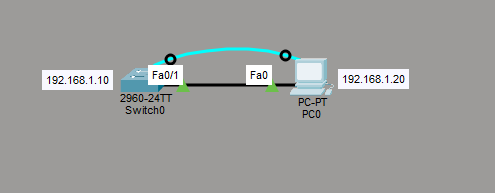
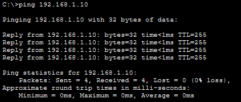
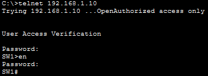

# Лабораторная работа 1. Базовая настройка коммутатора

## Цель
Создать сеть и настроить основные параметры коммутатора Cisco: обеспечить
консольный и удалённый (telnet) доступ, настроить IP-адрес управления и
продемонстрировать удалённое управление.

## Топология


| Устройство | Интерфейс | IP-адрес     | Назначение      |
|------------|-----------|--------------|-----------------|
| SW1        | VLAN 1    | 192.168.1.10 | IP управления   |
| PC1        | -         | 192.168.1.20 | Хост управления |

Оборудование: коммутатор Cisco WS-C2960-24TT-L, IOS 15.0(2)SE4.

## 1. Проверка настроек по умолчанию
До настройки коммутатор имел заводскую конфигурацию:
- hostname по умолчанию — `Switch`;
- все порты в VLAN 1 (`default`);
- IP-адрес на интерфейсе Vlan1 не назначен, интерфейс в состоянии shutdown;
- пароли и шифрование не настроены.

```
Current configuration : 1080 bytes
hostname Switch
...
interface Vlan1
 no ip address
 shutdown
line con 0
line vty 0 4
 login
```

```
VLAN Name        Status    Ports
1    default     active    Fa0/1 - Gig0/2  (все порты)
```

```
Vlan1   unassigned   YES manual  administratively down  down
```

## 2. Базовая настройка коммутатора
Выполнена конфигурация основных параметров:

```
hostname SW1
enable secret 5 $1$mERr$hx5rVt7rPNoS4wqbXKX7m0
service password-encryption
no ip domain-lookup
banner motd ^CAuthorized access only^C
!
interface Vlan1
 ip address 192.168.1.10 255.255.255.0
ip default-gateway 192.168.1.1
!
line con 0
 password 7 0822455D0A16
 login
 logging synchronous
 exec-timeout 5 0
!
line vty 0 4
 password 7 0822455D0A16
 login
 transport input telnet
```

Настроено:
- имя устройства `SW1`;
- пароль на привилегированный режим (`enable secret`, MD5-хэш);
- `service password-encryption` — шифрование паролей в конфигурации;
- пароль на консольную линию + `login`, `logging synchronous`, `exec-timeout`;
- пароль на линии vty 0-4 + `login`, `transport input telnet`;
- баннер MOTD;
- IP-адрес управления на SVI Vlan1 — 192.168.1.10/24;
- шлюз по умолчанию 192.168.1.1.

## 3. IP-адрес управления и удалённый доступ
Интерфейс Vlan1 поднят с адресом управления:

```
Vlan1   192.168.1.10   YES manual  up  up
```

Проверка связности с хоста PC1:



Удалённое управление коммутатором по telnet с хоста PC1:




## Вывод
Коммутатор настроен и доступен для удалённого управления через IP-адрес
192.168.1.10. Консольный и telnet-доступ защищены паролями, пароли в
конфигурации зашифрованы. Удалённое управление подтверждено успешным
telnet-подключением с хоста.