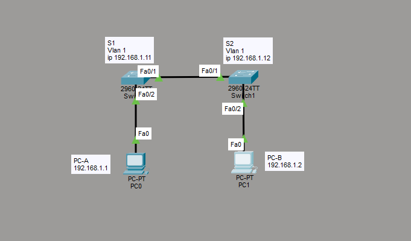

# Лабораторная работа 2. Просмотр таблицы MAC-адресов коммутатора

## Цель
Построить сеть из двух коммутаторов и двух ПК, изучить процесс построения таблицы MAC-адресов коммутатора и работу ARP на узлах.

## Топология


| Устройство | Интерфейс | IP-адрес     | Маска         | MAC-адрес            |
|------------|-----------|--------------|---------------|----------------------|
| S1         | VLAN 1    | 192.168.1.11 | 255.255.255.0 | (SVI) 0060.3e1c.0a17 |
| S2         | VLAN 1    | 192.168.1.12 | 255.255.255.0 | (SVI) 00d0.ffa7.6e99 |
| PC-A       | NIC       | 192.168.1.1  | 255.255.255.0 | 0009.7cb9.9d12       |
| PC-B       | NIC       | 192.168.1.2  | 255.255.255.0 | 000a.f356.7dad       |

Схема: PC-A подключён к S1, PC-B к S2, коммутаторы соединены между собой через F0/1.

## Часть 1. Настройка коммутаторов
На каждом коммутаторе выполнена базовая настройка: hostname, пароли, IP-адрес управления на SVI VLAN 1.

```
hostname S1
enable secret class
line con 0
 password cisco
 login
line vty 0 4
 password cisco
 login
interface vlan 1
 ip address 192.168.1.11 255.255.255.0
 no shutdown
 service password-encryption
 no ip domain-lookup
```

(на S2 аналогично, hostname S2, IP 192.168.1.12)

## Часть 2. Изучение таблицы MAC-адресов

### Шаг 1. MAC-адреса сетевых устройств

MAC-адреса ПК (`ipconfig /all`, поле Physical Address):

```
PC-A: 0009.7CB9.9D12
PC-B: 000A.F356.7DAD
```

**Вопрос: назовите физические адреса адаптера Ethernet.**

MAC PC-A: 0009.7CB9.9D12, MAC PC-B: 000A.F356.7DAD.

**Вопрос: назовите адреса оборудования (bia) во второй строке вывода.**

```
MAC S1 Fa0/1: 0090.2111.8c01 
MAC S2 Fa0/1: 0001.c9b1.cd01.
```

### Шаг 2. Таблица MAC-адресов до тестирования

```
S2# show mac address-table

Vlan  Mac Address       Type      Ports
1     0009.7cb9.9d12    DYNAMIC   Fa0/1
1     000a.f356.7dad    DYNAMIC   Fa0/2
1     0090.2111.8c01    DYNAMIC   Fa0/1
```

**Вопрос: записаны ли в таблице какие-либо MAC-адреса?**

Да. Коммутатор изучает MAC-адреса от служебного трафика, как только устройства подключены, даже без отправки ping.

**Вопрос: какие адреса записаны, на каких портах, каким устройствам принадлежат?**

На Fa0/2 изучен локальный узел PC-B (000a.f356.7dad). На Fa0/1 изучены адреса со стороны S1: PC-A (0009.7cb9.9d12) и порт S1 (0090.2111.8c01), доступные через единственный межкоммутаторный линк.

**Вопрос: как определить принадлежность MAC только по выводу команды? Работает ли это всегда?**

Сопоставить адреса с теми, что получены через `ipconfig /all` для ПК и `show interface` для коммутаторов. В любой ситуации это не работает: в крупной сети за одним портом могут находиться десятки адресов, и ручное сопоставление становится невозможным.

### Шаг 3. Очистка таблицы MAC-адресов

```
S2# clear mac address-table dynamic
S2# show mac address-table
1     0090.2111.8c01    DYNAMIC   Fa0/1
```

**Вопрос: указаны ли адреса для VLAN 1 сразу после очистки?**

Динамические записи удаляются. Сразу после очистки таблица практически пуста, но коммутатор мгновенно начинает переучивать адреса по мере прохождения трафика (виден один адрес, изученный немедленно).

**Вопрос: через 10 секунд появились ли новые адреса?**

Да. Через несколько секунд таблица наполняется снова, коммутатор переучивает MAC-адреса по мере трафика.

### Шаг 4. Эхо-запросы и наблюдение

ARP-кэш PC-B до отправки эхо-запросов:

```
C:\> arp -a
No ARP Entries Found
```

**Вопрос: сколько пар IP-MAC получено через ARP (без multicast/broadcast)?**

До эхо-запросов ARP-кэш пуст, ноль пар.

Эхо-запросы с PC-B на PC-A, S1 и S2:

```
ping 192.168.1.1    (PC-A)  — успешно
ping 192.168.1.11   (S1)    — первый пакет потерян, остальные успешно
ping 192.168.1.12   (S2)    — первый пакет потерян, остальные успешно
```

**Вопрос: от всех ли устройств получены ответы?**

Да, ответили все три устройства. Потеря первого пакета при обращении к новому адресу объясняется работой ARP: прежде чем отправить ICMP, узел выполняет ARP-запрос для определения MAC-адреса получателя, и первый пакет не успевает до завершения разрешения.

ARP-кэш PC-B после эхо-запросов:

```
C:\> arp -a
Internet Address   Physical Address   Type
192.168.1.1        0009.7cb9.9d12     dynamic   (PC-A)
192.168.1.11       0060.3e1c.0a17     dynamic   (SVI S1)
192.168.1.12       00d0.ffa7.6e99     dynamic   (SVI S2)
```

**Вопрос: появились ли новые записи в ARP-кэше PC-B?**

Да. Добавлены три пары IP-MAC для всех устройств, которым отправлялись эхо-запросы: PC-A, S1 и S2.

Таблица MAC-адресов S2 после эхо-запросов:

```
1     0009.7cb9.9d12    DYNAMIC   Fa0/1
1     000a.f356.7dad    DYNAMIC   Fa0/2
1     0060.3e1c.0a17    DYNAMIC   Fa0/1    (SVI S1, добавлен после ping)
1     0090.2111.8c01    DYNAMIC   Fa0/1
```

**Вопрос: добавил ли коммутатор новые MAC-адреса после эхо-запросов?**

Да. В таблицу добавлен MAC-адрес SVI коммутатора S1 (0060.3e1c.0a17) на порту Fa0/1 после отправки эхо-запроса на 192.168.1.11.

## Вывод (контрольный вопрос)
В крупных сетях возникают сложности. Таблица MAC-адресов ограничена по размеру, и при её переполнении коммутатор начинает рассылать кадры по всем портам, как концентратор, что снижает производительность и используется в атаках MAC-flooding. Широковещательный ARP-трафик растёт с числом устройств и создаёт нагрузку в больших плоских L2-доменах. Поэтому сети сегментируют на VLAN и применяют маршрутизацию L3, чтобы уменьшить размер broadcast-доменов.