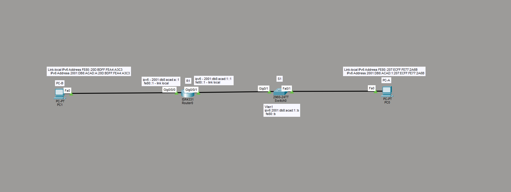

# Лабораторная работа - Настройка IPv6-адресов на сетевых устройствах

Настройка IPv6-адресации на интерфейсах маршрутизатора, коммутатора и хостов,
ручное назначение link-local адресов, проверка работы SLAAC и сквозной
связности через `ping` и `tracert`.

---

## Топология



Сеть состоит из маршрутизатора R1 (ISR4331), коммутатора S1 (2960) и двух
хостов. R1 разделяет два сегмента:

- **G0/0/0** - сеть `2001:db8:acad:a::/64` (сторона PC-A)
- **G0/0/1** - сеть `2001:db8:acad:1::/64` (сторона S1 и PC-B)

---

## Таблица адресации

| Устройство | Интерфейс | IPv6-адрес | Link-local | Префикс | Шлюз |
|---|---|---|---|---|---|
| R1 | G0/0/0 | 2001:db8:acad:a::1 | fe80::1 | /64 | - |
| R1 | G0/0/1 | 2001:db8:acad:1::1 | fe80::1 | /64 | - |
| S1 | VLAN 1 | 2001:db8:acad:1::b | fe80::b | /64 | - |
| PC-A | NIC | SLAAC из acad:a::/64 | EUI-64 | /64 | fe80::1 |
| PC-B | NIC | SLAAC из acad:1::/64 | EUI-64 | /64 | fe80::1 |

---

## Часть 1. Конфигурация R1

Назначение глобальных адресов и ручная установка одинакового link-local
`fe80::1` на оба интерфейса:

```
R1(config)# interface GigabitEthernet0/0/0
R1(config-if)# ipv6 address 2001:DB8:ACAD:A::1/64
R1(config-if)# ipv6 address FE80::1 link-local
R1(config-if)# no shutdown
R1(config-if)# exit
R1(config)# interface GigabitEthernet0/0/1
R1(config-if)# ipv6 address 2001:DB8:ACAD:1::1/64
R1(config-if)# ipv6 address FE80::1 link-local
R1(config-if)# no shutdown
R1(config-if)# exit
R1(config)# ipv6 unicast-routing
```

Проверка интерфейсов:

```
R1# show ipv6 interface brief
GigabitEthernet0/0/0   [up/up]
    FE80::1
    2001:DB8:ACAD:A::1
GigabitEthernet0/0/1   [up/up]
    FE80::1
    2001:DB8:ACAD:1::1
```

Итоговый фрагмент running-config:

```
interface GigabitEthernet0/0/0
 ipv6 address FE80::1 link-local
 ipv6 address 2001:DB8:ACAD:A::1/64
!
interface GigabitEthernet0/0/1
 ipv6 address FE80::1 link-local
 ipv6 address 2001:DB8:ACAD:1::1/64
!
```

### Группы многоадресной рассылки на G0/0/0

```
R1# show ipv6 interface gigabitEthernet 0/0/0
Joined group address(es):
    FF02::1            <- все узлы IPv6 (all-nodes)
    FF02::2            <- все маршрутизаторы IPv6 (all-routers)
    FF02::1:FF00:1     <- solicited-node (используется NDP, аналог ARP)
```

Группа `FF02::2` (all-routers) появляется только после включения
`ipv6 unicast-routing` - это подтверждает, что устройство стало
маршрутизатором.

---

## Часть 2. Конфигурация S1

S1 - коммутатор 2960, для IPv6 на SVI требуется шаблон SDM с поддержкой IPv6:

```
S1# show sdm prefer
S1# configure terminal
S1(config)# sdm prefer dual-ipv4-and-ipv6 default
S1(config)# end
S1# reload
```

После перезагрузки назначаем адрес интерфейсу управления (VLAN 1) вручную:

```
S1(config)# interface vlan 1
S1(config-if)# ipv6 address 2001:DB8:ACAD:1::B/64
S1(config-if)# ipv6 address FE80::B link-local
S1(config-if)# no shutdown
```

Проверка:

```
S1# show ipv6 interface brief
Vlan1                  [up/up]
    FE80::B
    2001:DB8:ACAD:1::B
```

---

## Часть 3. Адресация хостов - статика и SLAAC

По заданию каждый хост настраивается двумя способами последовательно.

### Вариант 1 - статический адрес (PC-B)

В IP Configuration выбран режим **Static**:

- IPv6 Address: `2001:DB8:ACAD:1::10`, префикс `64`
- Default Gateway: `FE80::1`
- Link-local генерируется хостом автоматически

```
C:\> ipconfig
   Link-local IPv6 Address. . . : FE80::201:C9FF:FE0D:1155
   IPv6 Address . . . . . . . . : 2001:DB8:ACAD:1::10
   Default Gateway. . . . . . . : FE80::1
```

Проверка связи со шлюзом:

```
C:\> ping 2001:DB8:ACAD:1::1
Reply from 2001:DB8:ACAD:1::1: bytes=32 time<1ms TTL=255
Reply from 2001:DB8:ACAD:1::1: bytes=32 time<1ms TTL=255
Reply from 2001:DB8:ACAD:1::1: bytes=32 time<1ms TTL=255
Reply from 2001:DB8:ACAD:1::1: bytes=32 time<1ms TTL=255
Ping statistics: Sent = 4, Received = 4, Lost = 0 (0% loss)
```

### Вариант 2 - автоконфигурация SLAAC

Тот же хост переключён в режим **Automatic** (`ipv6 request successful`).
Хост получает GUA автоматически из RA-сообщений R1:

```
C:\> ipconfig
   Link-local IPv6 Address. . . : FE80::207:ECFF:FE77:2A6B
   IPv6 Address . . . . . . . . : 2001:DB8:ACAD:1:207:ECFF:FE77:2A6B
   Default Gateway. . . . . . . : FE80::1
```

Сетевая часть (`2001:DB8:ACAD:1::/64`) взята из RA роутера, хостовая часть
(`:207:ECFF:FE77:2A6B`) построена самим хостом по EUI-64 из MAC-адреса.

---

## Часть 4. Проверка сквозной связности

**PC-A -> link-local шлюза (G0/1 на R1):**

```
C:\> ping FE80::1
Reply from FE80::1: bytes=32 time<1ms TTL=255   (x4, 0% loss)
```

**PC-A -> интерфейс управления S1 (из его же сети):**

```
C:\> ping 2001:DB8:ACAD:1::B
Reply from 2001:DB8:ACAD:1::B: bytes=32 time<1ms TTL=255   (x4, 0% loss)
```

**PC-A -> PC-B (через маршрутизатор):**

```
C:\> ping 2001:DB8:ACAD:A:20D:BDFF:FEA4:A3C3
Reply from 2001:DB8:ACAD:A:20D:BDFF:FEA4:A3C3: bytes=32 time<1ms TTL=127   (x4, 0% loss)
```

TTL=127 (а не 255) показывает, что пакет прошёл через один маршрутизатор -
значит маршрутизация между сетями `acad:1` и `acad:a` работает.

**tracert PC-A -> PC-B:**

```
C:\> tracert 2001:DB8:ACAD:1:207:ECFF:FE77:2A6B
  1   0 ms   0 ms   0 ms   2001:DB8:ACAD:A::1
  2   0 ms   0 ms   0 ms   2001:DB8:ACAD:1:207:ECFF:FE77:2A6B
Trace complete.
```

Маршрут из двух хопов: сначала шлюз (R1), затем целевой хост в соседней сети.

---

## Вопросы для повторения

**1. Назначен ли индивидуальный IPv6-адрес NIC на PC-B до включения маршрутизации?**

Нет. До команды `ipv6 unicast-routing` роутер не рассылает RA, поэтому хост
имеет только link-local адрес (`FE80::...`), который генерирует сам. Глобального
адреса нет, так как префикс приходит только из RA роутера.

**2. Почему PC-B получил глобальный префикс и идентификатор подсети, настроенные на R1?**

PC-B работает в режиме SLAAC и берёт префикс из RA-сообщений R1. Роутер
объявляет префикс своего интерфейса (`2001:db8:acad:1::/64`), и хост использует
его как сетевую часть адреса, дописав собственный Interface ID по EUI-64.
Сетевую часть хост не придумывает и не получает по DHCP - он копирует её прямо
из объявления роутера.

**3. Почему обоим Ethernet-интерфейсам R1 можно назначить один link-local `fe80::1`?**

Link-local адрес уникален только в пределах своего канала (линка), а не
глобально. G0/0/0 и G0/0/1 смотрят в разные сегменты, которые не пересекаются на
канальном уровне. Пакеты с link-local никогда не выходят за пределы своей сети,
поэтому одинаковый `fe80::1` на разных интерфейсах не вызывает конфликта. Это
ещё и удобно: всем хостам шлюз прописывается одинаково - `fe80::1`.

**4. Какой идентификатор подсети в адресе `2001:db8:acad::aaaa:1234/64`?**

Полная запись адреса (раскрываем `::`):

```
2001:0db8:acad:0000:0000:0000:aaaa:1234
```

При `/64` сетевая часть - первые четыре группы. Идентификатор подсети (Subnet ID)
это четвёртая группа между глобальным префиксом и Interface ID:

**Subnet ID = 0000 (то есть 0).**