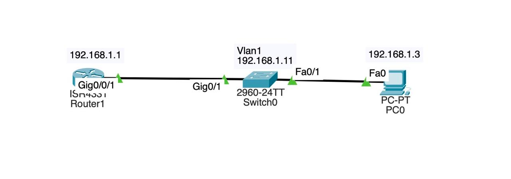

# Лабораторная работа — Настройка сетевых устройств для доступа по протоколу SSH

Настройка SSH на маршрутизаторе и коммутаторе, проверка подключения с ПК
и через CLI коммутатора.

---

## Топология



PC-A -> S1 (Fa0/6) -> S1 (Fa0/5) -> R1 (G0/0/1)

---

## Таблица адресации

| Устройство | Интерфейс | IP-адрес | Маска подсети | Шлюз по умолчанию |
|---|---|---|---|---|
| R1 | G0/0/1 | 192.168.1.1 | 255.255.255.0 | --- |
| S1 | VLAN 1 | 192.168.1.11 | 255.255.255.0 | 192.168.1.1 |
| PC-A | NIC | 192.168.1.3 | 255.255.255.0 | 192.168.1.1 |

---

## Часть 1. Настройка основных параметров устройств

### Конфигурация R1

```
hostname R1
no ip domain-lookup
ip domain-name anton.ru
enable secret 5 $1$mERr$9cTjUIEqNGurQiFU.ZeCi1
service password-encryption
!
banner motd ^CAuthorized Users Only!^C
!
interface GigabitEthernet0/0/1
 ip address 192.168.1.1 255.255.255.0
 duplex auto
 speed auto
!
line con 0
 password 7 0822455D0A16
 logging synchronous
 login
!
line vty 0 4
 login local
 transport input ssh
line vty 5 15
 login local
 transport input ssh
```

### Конфигурация S1

```
hostname S1
no ip domain-lookup
ip domain-name anton.ru
enable secret 5 $1$mERr$9cTjUIEqNGurQiFU.ZeCi1
service password-encryption
!
banner motd ^CAuthorized Users Only!^C
!
interface Vlan1
 ip address 192.168.1.11 255.255.255.0
!
ip default-gateway 192.168.1.1
!
line con 0
 password 7 0822455D0A16
 logging synchronous
 login
!
line vty 0 4
 login local
 transport input ssh
line vty 5 15
 login local
 transport input ssh
```

### Проверка подключения — PC-A -> R1

```
C:\> ping 192.168.1.1

Pinging 192.168.1.1 with 32 bytes of data:
Reply from 192.168.1.1: bytes=32 time<1ms TTL=255
Reply from 192.168.1.1: bytes=32 time<1ms TTL=255
Reply from 192.168.1.1: bytes=32 time<1ms TTL=255
Reply from 192.168.1.1: bytes=32 time<1ms TTL=255

Packets: Sent = 4, Received = 4, Lost = 0 (0% loss)
```

---

## Часть 2. Настройка маршрутизатора для доступа по SSH

Команды настройки SSH на R1:

```
R1(config)# ip domain-name anton.ru
R1(config)# crypto key generate rsa modulus 1024
R1(config)# username admin secret Adm1nP@55
R1(config)# ip ssh version 2
R1(config)# line vty 0 4
R1(config-line)# login local
R1(config-line)# transport input ssh
```

### Проверка SSH на R1

```
R1# show ip ssh
SSH Enabled - version 2.0
Authentication timeout: 120 secs; Authentication retries: 3
```

```
R1# show ssh
Connection  Version  Mode  Encryption    Hmac       State           Username
0           1.99     IN    aes128-cbc    hmac-sha1  Session Started admin
0           1.99     OUT   aes128-cbc    hmac-sha1  Session Started admin
%No SSHv1 server connections running.
```

### Подключение с PC-A к R1 по SSH

```
C:\> ssh -l admin 192.168.1.1

Password:
Authorized Users Only!
R1#
```

SSH-соединение с R1 установлено успешно.

---

## Часть 3. Настройка коммутатора для доступа по SSH

Команды настройки SSH на S1 аналогичны R1:

```
S1(config)# ip domain-name anton.ru
S1(config)# crypto key generate rsa modulus 1024
S1(config)# username cisco secret cisco
S1(config)# ip ssh version 2
S1(config)# line vty 0 4
S1(config-line)# login local
S1(config-line)# transport input ssh
S1(config)# line vty 5 15
S1(config-line)# login local
S1(config-line)# transport input ssh
```

### Проверка SSH на S1

```
S1# show ip ssh
SSH Enabled - version 2.0
Authentication timeout: 120 secs; Authentication retries: 3
```

### Подключение с PC-A к S1 по SSH

```
C:\> ssh -l cisco 192.168.1.11

Password:
Authorized Users Only!
S1#
```

**Вопрос: Удалось ли вам установить SSH-соединение с коммутатором?**

Да, SSH-соединение с коммутатором S1 установлено успешно.

---

## Часть 4. SSH через CLI коммутатора S1

### Доступные параметры команды ssh

```
S1# ssh ?
  -l  Log in using this user name
  -v  Specify SSH Protocol Version
```

Примечание: Packet Tracer поддерживает сокращённый набор параметров SSH.
В реальном IOS доступны дополнительные флаги: `-c` (алгоритм шифрования),
`-m` (HMAC), `-o` (опции), `-p` (порт), `-vrf` (VRF).

### Подключение с S1 к R1 по SSH

```
S1# ssh -l admin 192.168.1.1

Password:
Authorized Users Only!
R1>
```

### Переключение между сессиями (Ctrl+Shift+6, затем x)

```
R1>
S1#
```

### Возврат к сессии R1

```
S1#
[Resuming connection 2 to 192.168.1.1 ...]
R1>
```

### Завершение сессии SSH

```
R1> exit
[Connection to 192.168.1.1 closed by foreign host]
S1#
```

**Вопрос: Какие версии SSH поддерживаются при использовании CLI?**

При использовании CLI Cisco IOS поддерживаются SSHv1 и SSHv2. Версию можно
указать явно через параметр `-v`. На данном устройстве настроен `ip ssh version 2`,
однако в выводе `show ssh` отображается `1.99` - это режим совместимости Packet
Tracer, означающий SSHv2 с поддержкой обратной совместимости. В реальном
оборудовании с IOS-XE отображается чистая версия `2.0`.

---

## Вопрос для повторения

**Как предоставить доступ к сетевому устройству нескольким пользователям,
у каждого из которых есть собственное имя пользователя?**

Необходимо создать несколько записей в локальной базе учётных данных
с помощью команды `username`. Каждый пользователь получает своё имя и пароль:

```
R1(config)# username user1 secret password1
R1(config)# username user2 secret password2
R1(config)# username user3 secret password3
```

На линиях VTY должна быть настроена аутентификация по локальной базе:

```
R1(config)# line vty 0 4
R1(config-line)# login local
```

При таком подходе каждый пользователь входит под своим именем, что позволяет
отслеживать действия каждого в журнале (`show users`, `show logging`).