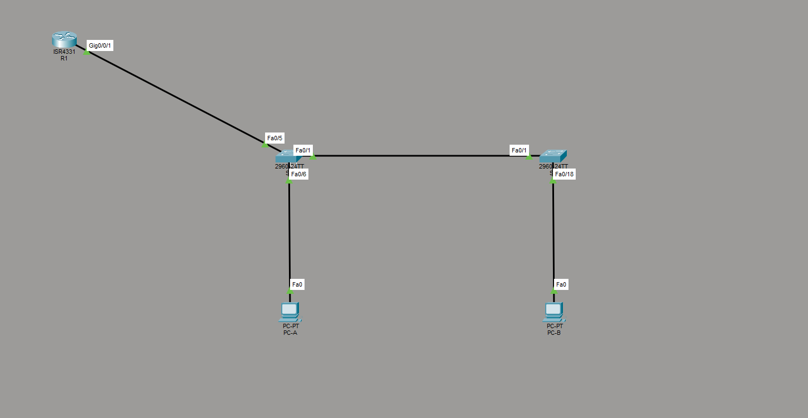

# Лабораторная работа - Настройка маршрутизации между VLAN (Router-on-a-Stick)

Создание VLAN, настройка транков 802.1Q и маршрутизации между VLAN
через подинтерфейсы роутера (router-on-a-stick).

---

## Топология



```
PC-A -> S1 (Fa0/6) -- S1 (Fa0/1) -- S2 (Fa0/1) -> PC-B (Fa0/18)
                       S1 (Fa0/5) -> R1 (G0/0/1)
```

---

## Таблица адресации

| Устройство | Интерфейс    | IP-адрес       | Маска подсети | Шлюз по умолчанию |
|---|---|---|---|---|
| R1 | G0/0/1.10  | 192.168.10.1   | 255.255.255.0 | --- |
| R1 | G0/0/1.20  | 192.168.20.1   | 255.255.255.0 | --- |
| R1 | G0/0/1.30  | 192.168.30.1   | 255.255.255.0 | --- |
| R1 | G0/0/1.1000 | ---           | ---           | --- |
| S1 | VLAN 10    | 192.168.10.11  | 255.255.255.0 | 192.168.10.1 |
| S2 | VLAN 10    | 192.168.10.12  | 255.255.255.0 | 192.168.10.1 |
| PC-A | NIC      | 192.168.20.3   | 255.255.255.0 | 192.168.20.1 |
| PC-B | NIC      | 192.168.30.3   | 255.255.255.0 | 192.168.30.1 |

---

## Таблица VLAN

| VLAN | Имя          | Назначенный интерфейс |
|---|---|---|
| 10   | Management   | S1: VLAN 10, S2: VLAN 10 |
| 20   | Sales        | S1: Fa0/6 |
| 30   | Operations   | S2: Fa0/18 |
| 999  | Parking_Lot  | S1: Fa0/2-4, Fa0/7-24, Gi0/1-2 |
|      |              | S2: Fa0/2-17, Fa0/19-24, Gi0/1-2 |
| 1000 | Собственная  | --- (native VLAN на транках) |

---

## Часть 1. Базовая настройка устройств

### R1

```
hostname R1
no ip domain-lookup
enable secret class
service password-encryption
banner motd ^CAuthorized Users Only!^C
!
line con 0
 password cisco
 login
line vty 0 4
 password cisco
 login
```

### S1

```
hostname S1
no ip domain-lookup
enable secret class
service password-encryption
banner motd ^CAuthorized Users Only!^C
!
interface Vlan10
 ip address 192.168.10.11 255.255.255.0
!
ip default-gateway 192.168.10.1
!
line con 0
 password cisco
 login
line vty 0 4
 password cisco
 login
```

### S2

```
hostname S2
no ip domain-lookup
enable secret class
service password-encryption
banner motd ^CAuthorized Users Only!^C
!
interface Vlan10
 ip address 192.168.10.12 255.255.255.0
!
ip default-gateway 192.168.10.1
!
line con 0
 password cisco
 login
line vty 0 4
 password cisco
 login
```

---

## Часть 2. Создание VLAN и назначение портов

### VLAN на S1

```
S1(config)# vlan 10
S1(config-vlan)# name Management
S1(config)# vlan 20
S1(config-vlan)# name Sales
S1(config)# vlan 30
S1(config-vlan)# name Operations
S1(config)# vlan 999
S1(config-vlan)# name Parking_Lot
S1(config)# vlan 1000
S1(config-vlan)# name Собственная

S1(config)# interface FastEthernet0/6
S1(config-if)# switchport mode access
S1(config-if)# switchport access vlan 20

S1(config)# interface range Fa0/2-4, Fa0/7-24, Gi0/1-2
S1(config-if-range)# switchport mode access
S1(config-if-range)# switchport access vlan 999
S1(config-if-range)# shutdown
```

### VLAN на S2

```
S2(config)# vlan 10
S2(config-vlan)# name Management
S2(config)# vlan 20
S2(config-vlan)# name Sales
S2(config)# vlan 30
S2(config-vlan)# name Operations
S2(config)# vlan 999
S2(config-vlan)# name Parking_Lot
S2(config)# vlan 1000
S2(config-vlan)# name Собственная

S2(config)# interface FastEthernet0/18
S2(config-if)# switchport mode access
S2(config-if)# switchport access vlan 30

S2(config)# interface range Fa0/2-17, Fa0/19-24, Gi0/1-2
S2(config-if-range)# switchport mode access
S2(config-if-range)# switchport access vlan 999
S2(config-if-range)# shutdown
```

### Проверка - show vlan brief S1

```
S1# show vlan brief

VLAN Name                             Status    Ports
---- -------------------------------- --------- ----------------------------
1    default                          active
10   Management                       active
20   Sales                            active    Fa0/6
30   Operations                       active
999  Parking_Lot                      active    Fa0/2, Fa0/3, Fa0/4, Fa0/7
                                                Fa0/8, Fa0/9, Fa0/10, Fa0/11
                                                Fa0/12, Fa0/13, Fa0/14, Fa0/15
                                                Fa0/16, Fa0/17, Fa0/18, Fa0/19
                                                Fa0/20, Fa0/21, Fa0/22, Fa0/23
                                                Fa0/24, Gig0/1, Gig0/2
```

### Проверка - show vlan brief S2

```
S2# show vlan brief

VLAN Name                             Status    Ports
---- -------------------------------- --------- ----------------------------
1    default                          active    Gig0/1, Gig0/2
10   Management                       active
20   Sales                            active
30   Operations                       active    Fa0/18
999  Parking_Lot                      active    Fa0/2, Fa0/3, Fa0/4, Fa0/5
                                                Fa0/6, Fa0/7, Fa0/8, Fa0/9
                                                Fa0/10, Fa0/11, Fa0/12, Fa0/13
                                                Fa0/14, Fa0/15, Fa0/16, Fa0/17
                                                Fa0/19, Fa0/20, Fa0/21, Fa0/22
                                                Fa0/23, Fa0/24
```

---

## Часть 3. Настройка транков 802.1Q

### Транки на S1

```
S1(config)# interface FastEthernet0/1
S1(config-if)# switchport mode trunk
S1(config-if)# switchport trunk native vlan 1000
S1(config-if)# switchport trunk allowed vlan 10,20,30,1000

S1(config)# interface FastEthernet0/5
S1(config-if)# switchport mode trunk
S1(config-if)# switchport trunk native vlan 1000
S1(config-if)# switchport trunk allowed vlan 10,20,30,1000
```

### Транк на S2

```
S2(config)# interface FastEthernet0/1
S2(config-if)# switchport mode trunk
S2(config-if)# switchport trunk native vlan 1000
S2(config-if)# switchport trunk allowed vlan 10,20,30,1000
```

### Проверка - show interfaces trunk S1

```
S1# show interfaces trunk

Port      Mode         Encapsulation  Status        Native vlan
Fa0/1     on           802.1q         trunking      1000
Fa0/5     on           802.1q         trunking      1000

Port      Vlans allowed on trunk
Fa0/1     10,20,30,1000
Fa0/5     10,20,30,1000

Port      Vlans allowed and active in management domain
Fa0/1     10,20,30
Fa0/5     10,20,30

Port      Vlans in spanning tree forwarding state and not pruned
Fa0/1     10,20,30
Fa0/5     10,20,30
```

### Проверка - show interfaces trunk S2

```
S2# show interfaces trunk

Port      Mode         Encapsulation  Status        Native vlan
Fa0/1     on           802.1q         trunking      1000

Port      Vlans allowed on trunk
Fa0/1     10,20,30,1000

Port      Vlans allowed and active in management domain
Fa0/1     10,20,30

Port      Vlans in spanning tree forwarding state and not pruned
Fa0/1     10,20,30
```

**Вопрос: Что произойдёт, если G0/0/1 на R1 будет отключён?**

Маршрутизация между VLAN полностью прекратится. Все подинтерфейсы
(G0/0/1.10, .20, .30, .1000) уйдут в состояние down, и хосты из разных
VLAN не смогут общаться друг с другом. Связь внутри одного VLAN останется,
так как она происходит на уровне коммутаторов без участия роутера.

---

## Часть 4. Настройка маршрутизации между VLAN на R1

```
R1(config)# interface GigabitEthernet0/0/1
R1(config-if)# no shutdown

R1(config)# interface GigabitEthernet0/0/1.10
R1(config-subif)# description Management
R1(config-subif)# encapsulation dot1Q 10
R1(config-subif)# ip address 192.168.10.1 255.255.255.0

R1(config)# interface GigabitEthernet0/0/1.20
R1(config-subif)# description Sales
R1(config-subif)# encapsulation dot1Q 20
R1(config-subif)# ip address 192.168.20.1 255.255.255.0

R1(config)# interface GigabitEthernet0/0/1.30
R1(config-subif)# description Operations
R1(config-subif)# encapsulation dot1Q 30
R1(config-subif)# ip address 192.168.30.1 255.255.255.0

R1(config)# interface GigabitEthernet0/0/1.1000
R1(config-subif)# description Собственная (native)
R1(config-subif)# encapsulation dot1Q 1000 native
```

### Проверка - show ip interface brief R1

```
R1# show ip interface brief

Interface              IP-Address      OK? Method Status   Protocol
GigabitEthernet0/0/0  unassigned      YES unset  admin down  down
GigabitEthernet0/0/1  unassigned      YES unset  up          up
GigabitEthernet0/0/1.10  192.168.10.1 YES manual up         up
GigabitEthernet0/0/1.20  192.168.20.1 YES manual up         up
GigabitEthernet0/0/1.30  192.168.30.1 YES manual up         up
GigabitEthernet0/0/1.1000 unassigned  YES unset  up         up
GigabitEthernet0/0/2  unassigned      YES unset  admin down  down
```

Все подинтерфейсы в состоянии up/up, IP-адреса назначены корректно.
Подинтерфейс .1000 (native VLAN) без IP-адреса - это правильно.

---

## Часть 5. Проверка маршрутизации между VLAN

### PC-A -> шлюз (192.168.20.1)

```
C:\> ping 192.168.20.1

Reply from 192.168.20.1: bytes=32 time<1ms TTL=255
Reply from 192.168.20.1: bytes=32 time<1ms TTL=255
Reply from 192.168.20.1: bytes=32 time<1ms TTL=255
Reply from 192.168.20.1: bytes=32 time<1ms TTL=255

Packets: Sent = 4, Received = 4, Lost = 0 (0% loss)
```

### PC-A -> PC-B (192.168.30.3) - маршрутизация между VLAN 20 и 30

```
C:\> ping 192.168.30.3

Reply from 192.168.30.3: bytes=32 time<1ms TTL=127
Reply from 192.168.30.3: bytes=32 time<1ms TTL=127
Reply from 192.168.30.3: bytes=32 time<1ms TTL=127
Reply from 192.168.30.3: bytes=32 time=6ms TTL=127

Packets: Sent = 4, Received = 4, Lost = 0 (0% loss)
```

TTL=127 подтверждает прохождение через один маршрутизатор (R1).

### PC-A -> S2 (192.168.10.12) - маршрутизация из VLAN 20 в VLAN 10

```
C:\> ping 192.168.10.12

Reply from 192.168.10.12: bytes=32 time<1ms TTL=254
Reply from 192.168.10.12: bytes=32 time=5ms TTL=254

Packets: Sent = 4, Received = 2, Lost = 2 (50% loss)
```

Первые два пакета потеряны из-за ARP-разрешения (нормальное поведение
в Packet Tracer при первом обращении к новому хосту). TTL=254 означает
два хопа: PC-A -> R1 -> S2.

### PC-B -> PC-A: tracert (192.168.20.3)

```
C:\> tracert 192.168.20.3

Tracing route to 192.168.20.3 over a maximum of 30 hops:
  1   0 ms   0 ms   0 ms   192.168.30.1
  2   0 ms   0 ms   0 ms   192.168.20.3

Trace complete.
```

**Вопрос: Какие промежуточные IP-адреса отображаются в результатах?**

Промежуточный адрес - `192.168.30.1`, это подинтерфейс G0/0/1.30 на R1
(шлюз по умолчанию для PC-B, VLAN 30). Пакет идёт через один хоп -
роутер R1 - и затем сразу достигает PC-A в VLAN 20.