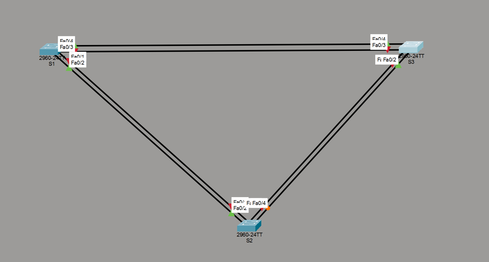

# Лабораторная работа - Развёртывание коммутируемой сети с резервными каналами (STP)

Наблюдение за выбором протоколом Spanning Tree корневого моста, а также
ролей портов на основе стоимости пути (cost) и приоритета портов.

---

## Топология



Три коммутатора (S1, S2, S3) соединены между собой избыточными каналами
(топология "треугольник"), создающими физическую петлю на уровне L2.

---

## Таблица адресации

| Устройство | Интерфейс | IP-адрес    | Маска подсети |
|---|---|---|---|
| S1 | VLAN 1 | 192.168.1.1 | 255.255.255.0 |
| S2 | VLAN 1 | 192.168.1.2 | 255.255.255.0 |
| S3 | VLAN 1 | 192.168.1.3 | 255.255.255.0 |

---

## Часть 1. Создание сети и настройка основных параметров

### S1

```
hostname S1
no ip domain-lookup
enable secret class
service password-encryption
spanning-tree mode pvst
banner motd ^CAuthorized Users Only!^C
!
interface Vlan1
 ip address 192.168.1.1 255.255.255.0
!
line con 0
 password cisco
 logging synchronous
 login
line vty 0 4
 password cisco
 logging synchronous
 login
line vty 5 15
 login
```

### S2

```
hostname S2
no ip domain-lookup
enable secret class
service password-encryption
spanning-tree mode pvst
banner motd ^CAuthorized Users Only!^C
!
interface Vlan1
 ip address 192.168.1.2 255.255.255.0
!
line con 0
 password cisco
 logging synchronous
 login
line vty 0 4
 password cisco
 logging synchronous
 login
line vty 5 15
 login
```

### S3

```
hostname S3
no ip domain-lookup
enable secret class
service password-encryption
spanning-tree mode pvst
banner motd ^CAuthorized Users Only!^C
!
interface Vlan1
 ip address 192.168.1.3 255.255.255.0
!
line con 0
 password cisco
 logging synchronous
 login
line vty 0 4
 password cisco
 logging synchronous
 login
line vty 5 15
 login
```

Все физические межкоммутаторные порты (Fa0/1–Fa0/4) настроены как
магистральные (`switchport mode trunk`), остальные порты отключены
(`shutdown`) - это требуется для последующего поэтапного включения
портов в Частях 2 и 4 при наблюдении за выбором ролей STP.

> **Проверка связи (выполнена с интерфейсов VLAN1):**

```
S1# ping 192.168.1.2
Success rate is 60 percent (3/5), round-trip min/avg/max = 0/0/0 ms

S1# ping 192.168.1.3
Success rate is 60 percent (3/5), round-trip min/avg/max = 0/2/7 ms

S2# ping 192.168.1.3
Success rate is 60 percent (3/5), round-trip min/avg/max = 0/0/0 ms
```

**Проверка связи:**

| Откуда | Куда | Результат |
|---|---|---|
| S1 | S2 | Успешно (60%, частичные потери из-за сходимости STP) |
| S1 | S3 | Успешно (60%, частичные потери из-за сходимости STP) |
| S2 | S3 | Успешно (60%, частичные потери из-за сходимости STP) |

Частичные потери (2 из 5 пакетов) объясняются тем, что в момент пинга
STP ещё находится в процессе пересчёта топологии после включения портов
(переход через состояния Listening → Learning → Forwarding занимает
время). Как только сходимость завершена, связь становится стабильной.

---

## Часть 2. Определение корневого моста

Отключены все порты, затем включены только Fa0/2 и Fa0/4 на всех
коммутаторах для наблюдения за первичным выбором ролей.

### S1 - корневой мост

```
S1# show spanning-tree
VLAN0001
  Spanning tree enabled protocol ieee
  Root ID    Priority    32769
             Address     0005.5EDA.D04A
             This bridge is the root
             Hello Time   2 sec  Max Age 20 sec  Forward Delay 15 sec

  Bridge ID  Priority    32769  (priority 32768 sys-id-ext 1)
             Address     0005.5EDA.D04A
             Hello Time   2 sec  Max Age 20 sec  Forward Delay 15 sec
             Aging Time   300 sec

Interface        Role Sts Cost      Prio.Nbr  Type
---------------- ---- --- --------- --------- --------
Fa0/2            Desg FWD 19        128.2     P2p
Fa0/4            Desg FWD 19        128.4     P2p
```

### S2 - некорневой мост

```
S2# show spanning-tree
VLAN0001
  Spanning tree enabled protocol ieee
  Root ID    Priority    32769
             Address     0005.5EDA.D04A
             Cost        19
             Port        2 (FastEthernet0/2)
             Hello Time   2 sec  Max Age 20 sec  Forward Delay 15 sec

  Bridge ID  Priority    32769  (priority 32768 sys-id-ext 1)
             Address     0060.47E3.D85B
             Hello Time   2 sec  Max Age 20 sec  Forward Delay 15 sec
             Aging Time   300 sec

Interface        Role Sts Cost      Prio.Nbr  Type
---------------- ---- --- --------- --------- --------
Fa0/2            Root FWD 19        128.2     P2p
Fa0/4            Desg FWD 19        128.4     P2p
```

### S3 - некорневой мост

```
S3# show spanning-tree
VLAN0001
  Spanning tree enabled protocol ieee
  Root ID    Priority    32769
             Address     0005.5EDA.D04A
             Cost        19
             Port        4 (FastEthernet0/4)
             Hello Time   2 sec  Max Age 20 sec  Forward Delay 15 sec

  Bridge ID  Priority    32769  (priority 32768 sys-id-ext 1)
             Address     00E0.A301.8179
             Hello Time   2 sec  Max Age 20 sec  Forward Delay 15 sec
             Aging Time   300 sec

Interface        Role Sts Cost      Prio.Nbr  Type
---------------- ---- --- --------- --------- --------
Fa0/2            Altn BLK 19        128.2     P2p
Fa0/4            Root FWD 19        128.4     P2p
```

### Схема ролей и состояний портов

| Коммутатор | Порт | Роль | Состояние |
|---|---|---|---|
| S1 (рут) | Fa0/2 | Designated | FWD |
| S1 (рут) | Fa0/4 | Designated | FWD |
| S2 | Fa0/2 | Root | FWD |
| S2 | Fa0/4 | Designated | FWD |
| S3 | Fa0/2 | Alternate | BLK |
| S3 | Fa0/4 | Root | FWD |

### Вопросы

**Какой коммутатор является корневым мостом?**
S1.

**Почему этот коммутатор был выбран протоколом spanning-tree в качестве корневого моста?**
У всех трёх коммутаторов значение приоритета идентификатора моста
одинаковое (32769 = 32768 + 1, где 1 - номер VLAN). Поскольку приоритеты
равны, корневым мостом становится коммутатор с наименьшим MAC-адресом -
в данном случае это S1 (адрес 0005.5EDA.D04A меньше, чем у S2 и S3).

**Какие порты на коммутаторах являются корневыми портами?**
S2: Fa0/2. S3: Fa0/4.

**Какие порты на коммутаторах являются назначенными портами?**
S1: Fa0/2 и Fa0/4 (оба, так как это корневой мост). S2: Fa0/4.

**Какой порт отображается в качестве альтернативного и в настоящее время заблокирован?**
S3: Fa0/2.

**Почему протокол spanning-tree выбрал этот порт в качестве невыделенного (заблокированного) порта?**
Стоимость пути до корневого моста (Path Cost) на обоих линках одинаковая.
При равной стоимости STP сравнивает Bridge ID отправителя (Designated
Bridge): у S1 MAC-адрес меньше, чем у S3, поэтому на сегменте между S1
и S3 назначенным становится порт S1, а порт S3 на этом же сегменте
переходит в состояние Alternate Blocked, чтобы разорвать физическую
петлю.

---

## Часть 3. Выбор порта на основе стоимости (cost)

Стоимость корневого порта на коммутаторе с заблокированным портом
(S3, интерфейс Fa0/4) уменьшена с 19 до 18:

```
S3(config)# interface FastEthernet0/4
S3(config-if)# spanning-tree vlan 1 cost 18
```

### S2 - до изменения cost

```
S2# show spanning-tree
VLAN0001
  Root ID    Priority 32769  Address 0005.5EDA.D04A
             Cost 19  Port 2 (FastEthernet0/2)
  Bridge ID  Priority 32769  Address 0060.47E3.D85B

Interface        Role Sts Cost      Prio.Nbr  Type
---------------- ---- --- --------- --------- --------
Fa0/2            Root FWD 19        128.2     P2p
Fa0/4            Desg FWD 19        128.4     P2p
```

### S2 - после изменения cost на S3

```
S2# show spanning-tree
VLAN0001
  Root ID    Priority 32769  Address 0005.5EDA.D04A
             Cost 19  Port 2 (FastEthernet0/2)
  Bridge ID  Priority 32769  Address 0060.47E3.D85B

Interface        Role Sts Cost      Prio.Nbr  Type
---------------- ---- --- --------- --------- --------
Fa0/2            Root FWD 19        128.2     P2p
Fa0/4            Altn BLK 19        128.4     P2p
```

### S3 - до изменения cost

```
S3# show spanning-tree
VLAN0001
  Root ID    Priority 32769  Address 0005.5EDA.D04A
             Cost 19  Port 4 (FastEthernet0/4)
  Bridge ID  Priority 32769  Address 00E0.A301.8179

Interface        Role Sts Cost      Prio.Nbr  Type
---------------- ---- --- --------- --------- --------
Fa0/2            Altn BLK 19        128.2     P2p
Fa0/4            Root FWD 19        128.4     P2p
```

### S3 - после изменения cost (после сходимости STP)

```
S3# show spanning-tree
VLAN0001
  Root ID    Priority 32769  Address 0005.5EDA.D04A
             Cost 18  Port 4 (FastEthernet0/4)
  Bridge ID  Priority 32769  Address 00E0.A301.8179

Interface        Role Sts Cost      Prio.Nbr  Type
---------------- ---- --- --------- --------- --------
Fa0/2            Desg FWD 19        128.2     P2p
Fa0/4            Root FWD 18        128.4     P2p
```

**Наблюдение:** после понижения cost на S3 (Fa0/4: 19 → 18) его суммарная
стоимость пути до корневого моста (Root Path Cost) стала равна 18 - ниже,
чем у соседнего S2 (19). На общем сегменте между S3 и S2 коммутатор
с меньшим Root Path Cost становится Designated. В результате порт S3
(Fa0/2), ранее заблокированный (Altn BLK), перешёл в Designated FWD,
а порт S2 (Fa0/4), ранее назначенный (Desg FWD), теперь проигрывает
сравнение и переходит в Alternate Blocked.

**Почему протокол spanning-tree заменяет ранее заблокированный порт на назначенный порт и блокирует порт, который был назначенным портом на другом коммутаторе?**

Уменьшение cost на корневом порту S3 снизило его суммарную стоимость
пути до корневого моста (Root Path Cost). При выборе Designated Port на
общем сегменте сравнивается не cost отдельного порта, а Root Path Cost
коммутатора целиком - меньшее значение побеждает. Поскольку Root Path
Cost у S3 стал ниже, чем у соседнего коммутатора, его порт перешёл из
Blocked в Designated, а порт соседа на этом же сегменте теперь проигрывает
сравнение и блокируется. Это демонстрирует, что в петле STP всегда
держит ровно одну точку блокировки - изменение cost управляет тем, где
именно она будет находиться.

Изменения отменены командой:

```
S3(config-if)# no spanning-tree vlan 1 cost 18
```

---

## Часть 4. Выбор порта на основе приоритета портов

Включены порты Fa0/1 и Fa0/3 на всех коммутаторах для активации
дополнительных избыточных путей.

### S2 - после включения Fa0/1 и Fa0/3

```
S2# show spanning-tree
VLAN0001
  Spanning tree enabled protocol ieee
  Root ID    Priority    32769
             Address     0005.5EDA.D04A
             Cost        19
             Port        1 (FastEthernet0/1)
             Hello Time   2 sec  Max Age 20 sec  Forward Delay 15 sec

  Bridge ID  Priority    32769  (priority 32768 sys-id-ext 1)
             Address     0060.47E3.D85B
             Hello Time   2 sec  Max Age 20 sec  Forward Delay 15 sec
             Aging Time   300 sec

Interface        Role Sts Cost      Prio.Nbr  Type
---------------- ---- --- --------- --------- --------
Fa0/1            Root FWD 19        128.1     P2p
Fa0/2            Altn BLK 19        128.2     P2p
Fa0/3            Desg FWD 19        128.3     P2p
Fa0/4            Desg FWD 19        128.4     P2p
```

### S3 - после включения Fa0/1 и Fa0/3

```
S3# show spanning-tree
VLAN0001
  Spanning tree enabled protocol ieee
  Root ID    Priority    32769
             Address     0005.5EDA.D04A
             Cost        19
             Port        3 (FastEthernet0/3)
             Hello Time   2 sec  Max Age 20 sec  Forward Delay 15 sec

  Bridge ID  Priority    32769  (priority 32768 sys-id-ext 1)
             Address     00E0.A301.8179
             Hello Time   2 sec  Max Age 20 sec  Forward Delay 15 sec
             Aging Time   300 sec

Interface        Role Sts Cost      Prio.Nbr  Type
---------------- ---- --- --------- --------- --------
Fa0/1            Altn BLK 19        128.1     P2p
Fa0/2            Altn BLK 19        128.2     P2p
Fa0/3            Root FWD 19        128.3     P2p
Fa0/4            Altn BLK 19        128.4     P2p
```

### Вопросы

**Какой порт выбран протоколом STP в качестве порта корневого моста на каждом коммутаторе некорневого моста?**
S2: Fa0/1. S3: Fa0/3.

**Почему протокол STP выбрал эти порты в качестве портов корневого моста на этих коммутаторах?**

Стоимость пути (Path Cost) на всех доступных линках до корневого моста
одинаковая (19), и Bridge ID отправителя (S1) тоже одинаковый, так как
все линки ведут к одному и тому же корневому мосту. Решающим фактором
стал Port ID отправителя - номер порта на стороне корневого моста (S1),
с которого приходит BPDU. STP выбирает линк, подключённый к меньшему
номеру порта на корневом коммутаторе, поэтому корневой порт переместился
на линк с меньшим номером и заблокировал предыдущий.

---

## Вопросы для повторения

**1. Какое значение протокол STP использует первым после выбора корневого моста, чтобы определить выбор порта?**

Стоимость пути до корневого моста (Path Cost). Порт с наименьшей
стоимостью пути является предпочтительным.

**2. Если первое значение на двух портах одинаково, какое следующее значение будет использовать протокол STP при выборе порта?**

Bridge ID отправителя (Sender BID) - приоритет и MAC-адрес коммутатора,
от которого пришёл BPDU. Меньшее значение предпочтительнее.

**3. Если оба значения на двух портах равны, каким будет следующее значение, которое использует протокол STP при выборе порта?**

Port ID отправителя (Sender Port ID) - номер порта на стороне
коммутатора-отправителя, с которого пришёл BPDU. Меньший номер порта
предпочтительнее.