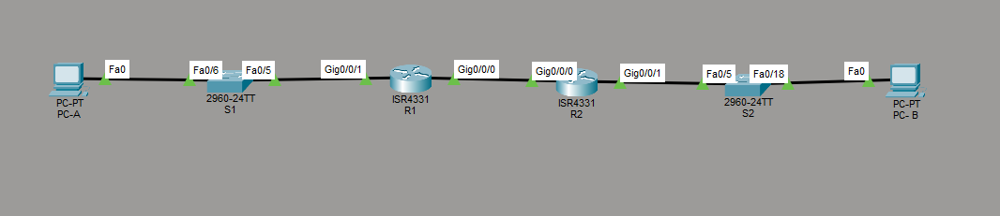

# Лабораторная работа - Настройка DHCPv4

Настройка динамической адресации IPv4 на маршрутизаторе R1 (два пула
для разных подсетей) и настройка DHCP Relay на R2 для доставки
запросов в удалённую подсеть.

---

## Топология



```
PC-A -- S1 (Fa0/6, VLAN 100) -- S1 (Fa0/5, trunk) -- R1 (G0/0/1)
R1 (G0/0/0) -- R2 (G0/0/0)
R2 (G0/0/1) -- S2 (Fa0/5) -- S2 (Fa0/18) -- PC-B
```

---

## Расчёт VLSM

Исходная сеть: **192.168.1.0/24**

| Подсеть | Назначение | Нужно хостов | Маска | Вместимость | Сеть | Диапазон | Broadcast |
|---|---|---|---|---|---|---|---|
| A | VLAN 100, клиенты (R1) | 58 | /26 | 62 | 192.168.1.0/26 | .1-.62 | .63 |
| B | VLAN 200, управление (R1) | 28 | /27 | 30 | 192.168.1.64/27 | .65-.94 | .95 |
| C | клиенты (R2) | 12 | /28 | 14 | 192.168.1.96/28 | .97-.110 | .111 |

Свободно осталось `192.168.1.112 - 192.168.1.255` под будущее расширение.

---

## Таблица адресации

| Устройство | Интерфейс | IP-адрес | Маска подсети |
|---|---|---|---|
| R1 | G0/0/0 | 10.0.0.1 | 255.255.255.252 |
| R1 | G0/0/1.100 | 192.168.1.1 | 255.255.255.192 |
| R1 | G0/0/1.200 | 192.168.1.65 | 255.255.255.224 |
| R1 | G0/0/1.1000 | --- (native, без IP) | --- |
| R2 | G0/0/0 | 10.0.0.2 | 255.255.255.252 |
| R2 | G0/0/1 | 192.168.1.97 | 255.255.255.240 |
| S1 | VLAN 200 | 192.168.1.66 | 255.255.255.224 |
| S2 | VLAN 1 | 192.168.1.98 | 255.255.255.240 |
| PC-A | NIC | DHCP | DHCP |
| PC-B | NIC | DHCP | DHCP |

---

## Таблица VLAN

| VLAN | Имя | Назначенный интерфейс |
|---|---|---|
| 1 | Нет | S2: Fa0/18 |
| 100 | Clients | S1: Fa0/6 |
| 200 | Management | S1: VLAN 200 |
| 999 | Parking_Lot | S1: Fa0/1-4, Fa0/7-24, Gi0/1-2 |
| 1000 | Native | --- (native VLAN на транке) |

---

## Часть 1. Создание сети и настройка основных параметров устройства

### Базовая настройка R1 и R2

```
hostname R1
no ip domain-lookup
enable secret class
service password-encryption
banner motd ^CAuthorized Users Only!^C
!
line con 0
 password cisco
 login
line vty 0 4
 password cisco
 login
```

На R2 - аналогично, `hostname R2`.

### Настройка под-интерфейсов на R1

```
R1(config)# interface GigabitEthernet0/0/1
R1(config-if)# no shutdown

R1(config)# interface GigabitEthernet0/0/1.100
R1(config-subif)# description Client_LAN
R1(config-subif)# encapsulation dot1Q 100
R1(config-subif)# ip address 192.168.1.1 255.255.255.192

R1(config)# interface GigabitEthernet0/0/1.200
R1(config-subif)# description Management_LAN
R1(config-subif)# encapsulation dot1Q 200
R1(config-subif)# ip address 192.168.1.65 255.255.255.224

R1(config)# interface GigabitEthernet0/0/1.1000
R1(config-subif)# description Native_VLAN
R1(config-subif)# encapsulation dot1Q 1000 native
```

Подинтерфейс native VLAN (.1000) намеренно не получает IP-адрес.

### Проверка под-интерфейсов

```
R1# show ip interface brief

GigabitEthernet0/0/1        unassigned      up up
GigabitEthernet0/0/1.100    192.168.1.1     up up
GigabitEthernet0/0/1.200    192.168.1.65    up up
GigabitEthernet0/0/1.1000   unassigned      up up
```

### Настройка линка между маршрутизаторами и статической маршрутизации

```
R1(config)# interface GigabitEthernet0/0/0
R1(config-if)# ip address 10.0.0.1 255.255.255.252
R1(config-if)# no shutdown
R1(config)# ip route 0.0.0.0 0.0.0.0 10.0.0.2
```

```
R2(config)# interface GigabitEthernet0/0/0
R2(config-if)# ip address 10.0.0.2 255.255.255.252
R2(config-if)# no shutdown
R2(config)# interface GigabitEthernet0/0/1
R2(config-if)# ip address 192.168.1.97 255.255.255.240
R2(config-if)# no shutdown
R2(config)# ip route 0.0.0.0 0.0.0.0 10.0.0.1
```

### Проверка маршрутизации - пинг G0/0/1 R2 с R1

```
R1# ping 192.168.1.97

Success rate is 100 percent (5/5), round-trip min/avg/max = 0/0/0 ms
```

### Базовая настройка коммутаторов S1 и S2

Аналогичная базовая настройка (hostname, пароли, banner) выполнена
на обоих коммутаторах.

### Создание VLAN на S1

```
S1(config)# vlan 100
S1(config-vlan)# name Clients
S1(config)# vlan 200
S1(config-vlan)# name Management
S1(config)# vlan 999
S1(config-vlan)# name Parking_Lot
S1(config)# vlan 1000
S1(config-vlan)# name Native
```

### SVI управления на S1 и S2

```
S1(config)# interface vlan 200
S1(config-if)# ip address 192.168.1.66 255.255.255.224
S1(config-if)# no shutdown
S1(config)# ip default-gateway 192.168.1.65
```

```
S2(config)# interface vlan 1
S2(config-if)# ip address 192.168.1.98 255.255.255.240
S2(config-if)# no shutdown
S2(config)# ip default-gateway 192.168.1.97
```

### Назначение VLAN на используемые интерфейсы S1

```
S1(config)# interface FastEthernet0/6
S1(config-if)# switchport mode access
S1(config-if)# switchport access vlan 100
```

**Вопрос: Почему интерфейс F0/5 указан в VLAN 1?**

На момент проверки интерфейс F0/5 (на S2, ведущий к R2) не был явно
назначен ни в одну VLAN командой `switchport access vlan`. На
коммутаторах Cisco все порты по умолчанию принадлежат VLAN 1 (default
VLAN), пока администратор не переназначит их вручную. Поскольку по
заданию для S2 не требовалось создавать VLAN и переключать порты,
F0/5 остался в состоянии по умолчанию.

### Настройка F0/5 на S1 в качестве транка 802.1Q

```
S1(config)# interface FastEthernet0/5
S1(config-if)# switchport mode trunk
S1(config-if)# switchport trunk native vlan 1000
S1(config-if)# switchport trunk allowed vlan 100,200,1000
```

Команда `switchport trunk encapsulation dot1q` на данной платформе
отсутствует в списке `switchport ?` - реальные коммутаторы Catalyst
2960 поддерживают только dot1q-инкапсуляцию, поэтому явный выбор
инкапсуляции не требуется.

### Проверка состояния транка

```
S1# show interfaces trunk

Port    Mode    Encapsulation  Status     Native vlan
Fa0/5   on      802.1q         trunking   1000

Port    Vlans allowed on trunk
Fa0/5   100,200,1000
```

После поднятия транка интерфейс Vlan200 перешёл в полностью рабочее
состояние `up/up` - SVI не мог подняться раньше, так как VLAN 200 не
имел активного пути наружу до настройки транка.

**Вопрос: Какой IP-адрес был бы у ПК, если бы он был подключен к
сети с помощью DHCP?**

На данном этапе (до Части 2) DHCP-сервер ещё не настроен ни на одном
маршрутизаторе. Хост Windows при недоступности DHCP автоматически
назначает себе адрес из диапазона APIPA (169.254.0.0/16), а не адрес
из сети 192.168.1.0/24.

### Неиспользуемые порты - Parking Lot на S1

```
S1(config)# interface range FastEthernet0/1-4, FastEthernet0/7-24, GigabitEthernet0/1-2
S1(config-if-range)# switchport mode access
S1(config-if-range)# switchport access vlan 999
S1(config-if-range)# shutdown
```

### Административное отключение неиспользуемых портов на S2

```
S2(config)# interface range FastEthernet0/1-4, FastEthernet0/6-17, FastEthernet0/19-24, GigabitEthernet0/1-2
S2(config-if-range)# shutdown
```

На S2 VLAN не создаются - согласно заданию, S2 настроен только
с базовыми параметрами.

---

## Часть 2. Настройка и проверка двух серверов DHCPv4 на R1

### Пул для Подсети A (клиенты, VLAN 100)

```
R1(config)# ip dhcp excluded-address 192.168.1.1 192.168.1.5
R1(config)# ip dhcp pool R1_Client_LAN
R1(dhcp-config)# network 192.168.1.0 255.255.255.192
R1(dhcp-config)# default-router 192.168.1.1
R1(dhcp-config)# domain-name CCNA-lab.com
```

### Пул для Подсети C (клиенты на R2)

```
R1(config)# ip dhcp excluded-address 192.168.1.97 192.168.1.101
R1(config)# ip dhcp pool R2_Client_LAN
R1(dhcp-config)# network 192.168.1.96 255.255.255.240
R1(dhcp-config)# default-router 192.168.1.97
R1(dhcp-config)# domain-name CCNA-lab.com
```

**Примечание по платформе:** команда `lease <дни> <часы> <минуты>`
для настройки времени аренды (по заданию - 2 дня 12 часов 30 минут)
отсутствует в данной версии платформы как в режиме `dhcp-config`, так
и глобально (`ip dhcp ?` не содержит ветки `lease`). Это ограничение
образа, не связанное с ошибкой конфигурации - пулы работают с
дефолтным временем аренды платформы.

### Проверка пулов

```
R1# show ip dhcp pool

Pool R1_Client_LAN:
   Total addresses: 62
   1 subnet is currently in the pool
   192.168.1.1   192.168.1.1 - 192.168.1.62

Pool R2_Client_LAN:
   Total addresses: 14
   1 subnet is currently in the pool
   192.168.1.97  192.168.1.97 - 192.168.1.110
```

### Проверка на PC-A

```
C:\> ipconfig /all

FastEthernet0 Connection:(default port)
   Connection-specific DNS Suffix..: CCNA-lab.com
   Physical Address.................: 00D0.FF2E.0ED4
   IPv4 Address......................: 192.168.1.6
   Subnet Mask.......................: 255.255.255.192
   Default Gateway...................: 192.168.1.1
   DHCP Servers......................: 192.168.1.1
```

Адрес получен из ожидаемого пула, после исключённого диапазона
(.1-.5), суффикс домена и шлюз соответствуют настройке пула.

### Проверка привязки на R1

```
R1# show ip dhcp binding

IP address       Client-ID/Hardware address    Type
192.168.1.6      00D0.FF2E.0ED4                Automatic
```

MAC-адрес привязки совпадает с Physical Address на PC-A.

### Проверка связи PC-A -> шлюз R1

```
C:\> ping 192.168.1.1

Reply from 192.168.1.1: bytes=32 time<1ms TTL=255   (x4, 0% loss)
```

---

## Часть 3. Настройка и проверка DHCP-ретрансляции на R2

DHCP-сервер физически расположен на R1, а клиент PC-B - в сети,
подключённой к R2. Поскольку DHCP-запросы являются broadcast и не
пересекают границу маршрутизатора самостоятельно, на R2 настроен
DHCP Relay через `ip helper-address`.

### Настройка Relay на R2

```
R2(config)# interface GigabitEthernet0/0/1
R2(config-if)# ip helper-address 10.0.0.1
```

`ip helper-address` указывает на адрес интерфейса R1, обращённого
к R2 (10.0.0.1) - то есть на DHCP-сервер, физически находящийся
в другой подсети.

### Проверка на PC-B

```
C:\> ipconfig /all

FastEthernet0 Connection:(default port)
   Connection-specific DNS Suffix..: CCNA-lab.com
   Physical Address.................: 0001.9712.6A10
   IPv4 Address......................: 192.168.1.102
   Subnet Mask.......................: 255.255.255.240
   Default Gateway...................: 192.168.1.97
   DHCP Servers......................: 10.0.0.1
```

**Ключевое подтверждение работы Relay:** поле `DHCP Servers` показывает
`10.0.0.1` - адрес R1 на линке к R2, а не локальный адрес сети PC-B.
Это прямое доказательство, что запрос был переслан через R2 на
удалённый сервер R1 и обратно, а не обслужен локально.

### Проверка связи PC-B -> шлюз R1 (через два маршрутизатора)

```
C:\> ping 192.168.1.1

Reply from 192.168.1.1: bytes=32 time<1ms TTL=254   (x4, 0% loss)
```

TTL=254 подтверждает прохождение через два маршрутизатора (R2 и R1).

### Финальная проверка привязок на R1

```
R1# show ip dhcp binding

IP address       Client-ID/Hardware address    Type
192.168.1.6      00D0.FF2E.0ED4                Automatic
192.168.1.102    0001.9712.6A10                Automatic
```

Оба клиента (PC-A напрямую и PC-B через Relay) получили адреса от
одного и того же DHCP-сервера на R1 - лабораторная работа
демонстрирует оба сценария полностью: локальное обслуживание и
обслуживание через ретрансляцию.

---

## Итог

| Клиент | Способ получения адреса | Полученный адрес | DHCP-сервер (по мнению клиента) |
|---|---|---|---|
| PC-A | Напрямую (Часть 2) | 192.168.1.6 | 192.168.1.1 (локальный) |
| PC-B | Через DHCP Relay (Часть 3) | 192.168.1.102 | 10.0.0.1 (удалённый) |

В отличие от аналогичной лабораторной работы по DHCPv6, где Relay
(`ipv6 dhcp relay`) не поддерживается в Cisco Packet Tracer, механизм
`ip helper-address` для IPv4 полностью работоспособен и был успешно
проверен практически.