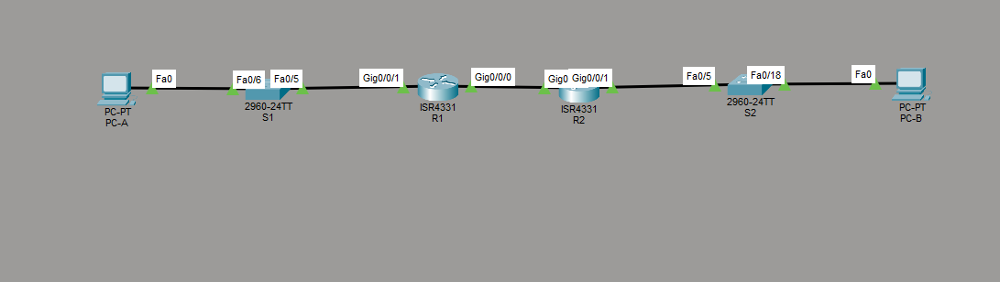

# Лабораторная работа - Настройка DHCPv6

Настройка динамического назначения IPv6-адресов тремя способами: SLAAC,
DHCPv6 без отслеживания состояния (Stateless) и DHCPv6 с отслеживанием
состояния (Stateful), а также настройка DHCPv6 Relay.

---

## Топология



```
PC-A -- S1 (Fa0/6) -- S1 (Fa0/5) -- R1 (G0/0/1)
R1 (G0/0/0) -- R2 (G0/0/0)
R2 (G0/0/1) -- S2 (Fa0/5) -- S2 (Fa0/18) -- PC-B
```

Использование коммутаторов в данной лабораторной работе опционально.

---

## Таблица адресации

| Устройство | Интерфейс | IPv6-адрес |
|---|---|---|
| R1 | G0/0/0 | 2001:db8:acad:2::1/64 |
| R1 | G0/0/0 | fe80::1 |
| R1 | G0/0/1 | 2001:db8:acad:1::1/64 |
| R1 | G0/0/1 | fe80::1 |
| R2 | G0/0/0 | 2001:db8:acad:2::2/64 |
| R2 | G0/0/0 | fe80::2 |
| R2 | G0/0/1 | 2001:db8:acad:3::1/64 |
| R2 | G0/0/1 | fe80::1 |
| PC-A | NIC | DHCP |
| PC-B | NIC | DHCP |

---

## Часть 1. Создание сети и настройка основных параметров устройства

### Базовая настройка коммутаторов (опционально)

```
S1# show running-config

hostname S1
enable secret 5 $1$mERr$9cTjUIEqNGurQiFU.ZeCi1
no ip domain-lookup
spanning-tree mode pvst
spanning-tree extend system-id
!
interface Vlan1
 no ip address
 shutdown
!
banner motd ^CAuthorized Users Only!^C
!
line con 0
 password 7 0822455D0A16
 logging synchronous
 login
line vty 0 4
 password 7 0822455D0A16
 logging synchronous
 login
line vty 5 15
 login
```

```
S2# show running-config

hostname S2
enable secret 5 $1$mERr$9cTjUIEqNGurQiFU.ZeCi1
no ip domain-lookup
spanning-tree mode pvst
spanning-tree extend system-id
!
interface Vlan1
 no ip address
 shutdown
!
banner motd ^CAuthorized Users Only!^C
!
line con 0
 password 7 0822455D0A16
 logging synchronous
 login
line vty 0 4
 password 7 0822455D0A16
 logging synchronous
 login
line vty 5 15
 login
```

### Базовая настройка маршрутизаторов и активация IPv6-маршрутизации

```
R1# show running-config

hostname R1
enable secret 5 $1$mERr$9cTjUIEqNGurQiFU.ZeCi1
no ip domain-lookup
ip cef
ipv6 unicast-routing
no ipv6 cef
!
banner motd ^CAuthorized Users Only!^C
!
line con 0
 password 7 0822455D0A16
 logging synchronous
 login
line vty 0 4
 password 7 0822455D0A16
 logging synchronous
 login
line vty 5 15
 login
```

На R2 выполнена аналогичная базовая настройка (hostname, пароли,
banner, `ipv6 unicast-routing`).

### Настройка интерфейсов и маршрутизации на R1 и R2

```
R1(config)# interface GigabitEthernet0/0/0
R1(config-if)# ipv6 address FE80::1 link-local
R1(config-if)# ipv6 address 2001:DB8:ACAD:2::1/64
R1(config-if)# no shutdown
R1(config)# interface GigabitEthernet0/0/1
R1(config-if)# ipv6 address FE80::1 link-local
R1(config-if)# ipv6 address 2001:DB8:ACAD:1::1/64
R1(config-if)# no shutdown
R1(config)# ipv6 route ::/0 2001:DB8:ACAD:2::2
```

```
R2(config)# interface GigabitEthernet0/0/0
R2(config-if)# ipv6 address FE80::2 link-local
R2(config-if)# ipv6 address 2001:DB8:ACAD:2::2/64
R2(config-if)# no shutdown
R2(config)# interface GigabitEthernet0/0/1
R2(config-if)# ipv6 address FE80::1 link-local
R2(config-if)# ipv6 address 2001:DB8:ACAD:3::1/64
R2(config-if)# no shutdown
R2(config)# ipv6 route ::/0 2001:DB8:ACAD:2::1
```

Маршрут по умолчанию на каждом маршрутизаторе указывает на IP-адрес
G0/0/0 на другом маршрутизаторе.

### Проверка маршрутизации - пинг адреса G0/0/1 R2 из R1

```
R1# ping 2001:db8:acad:3::1

Reply from 2001:DB8:ACAD:3::1: bytes=32 time<1ms TTL=254
Reply from 2001:DB8:ACAD:3::1: bytes=32 time<1ms TTL=254
Reply from 2001:DB8:ACAD:3::1: bytes=32 time<1ms TTL=254
Reply from 2001:DB8:ACAD:3::1: bytes=32 time<1ms TTL=254

Ping statistics for 2001:DB8:ACAD:3::1:
Packets: Sent = 4, Received = 4, Lost = 0 (0% loss)
```

TTL=254 подтверждает прохождение пакета через один транзитный узел
(R2), то есть маршрутизация между R1 и R2 через статические маршруты
по умолчанию работает корректно.

Дополнительно проверена прямая связь между R1 и R2 по линку G0/0/0:

```
R1# ping 2001:db8:acad:2::2
Success rate is 100 percent (5/5), round-trip min/avg/max = 0/0/0 ms

R2# ping 2001:db8:acad:2::1
Success rate is 100 percent (5/5), round-trip min/avg/max = 0/0/1 ms
```

---

## Часть 2. Проверка назначения адреса SLAAC от R1

Включен PC-A, сетевой адаптер настроен на автоматическую конфигурацию
IPv6. PC-A должен присвоить себе адрес из сети `2001:db8:acad:1::/64`.

```
C:\> ipconfig /all

FastEthernet0 Connection:(default port)
   Physical Address...........: 0002.179A.0EA6
   Link-local IPv6 Address....: FE80::202:17FF:FE9A:EA6
   IPv6 Address................: 2001:DB8:ACAD:1:202:17FF:FE9A:EA6
   Default Gateway.............: FE80::1
   DNS Servers...................: ::
```

**Вопрос: Откуда взялась часть адреса с идентификатором хоста?**

Идентификатор интерфейса (последние 64 бита) сгенерирован из
MAC-адреса сетевой карты (`0002.179A.0EA6`) методом EUI-64:
MAC-адрес разделён пополам, между половинами вставлена комбинация
FFFE, и инвертирован седьмой бит (U/L bit). Это стандартный механизм
SLAAC - DHCPv6-сервер на этом этапе не задействован, адрес получен
только из префикса в Router Advertisement.

---

## Часть 3. Настройка и проверка сервера DHCPv6 без сохранения состояния на R1

Цель - предоставить PC-A информацию о DNS-сервере и домене, при этом
сам IPv6-адрес по-прежнему назначается через SLAAC.

### Настройка пула R1-STATELESS

```
R1(config)# ipv6 dhcp pool R1-STATELESS
R1(config-dhcp)# dns-server 2001:db8:acad::254
R1(config-dhcp)# domain-name STATELESS.com
```

### Назначение флага OTHER и пула на интерфейс G0/0/1

```
R1(config)# interface g0/0/1
R1(config-if)# ipv6 nd other-config-flag
R1(config-if)# ipv6 dhcp server R1-STATELESS
```

### Проверка на PC-A после настройки

```
C:\> ipconfig /all

FastEthernet0 Connection:(default port)
   Connection-specific DNS Suffix..: STATELESS.com
   Physical Address.................: 0002.179A.0EA6
   Link-local IPv6 Address..........: FE80::202:17FF:FE9A:EA6
   IPv6 Address......................: 2001:DB8:ACAD:1:202:17FF:FE9A:EA6
   Default Gateway...................: FE80::1
   DHCPv6 IAID........................: 1404199159
   DHCPv6 Client DUID.................: 00-01-00-01-92-60-D7-E0-00-02-17-9A-0E-A6
   DNS Servers........................: 2001:DB8:ACAD::254
```

**IPv6-адрес не изменился** - SLAAC продолжает строить его сам (флаг
M=0). Появились **DNS-сервер и суффикс домена**, полученные от
DHCPv6-сервера (флаг O=1, `ipv6 nd other-config-flag`). Это и есть
демонстрация Stateless DHCPv6: адрес через SLAAC, доп. параметры через
DHCPv6.

### Проверка подключения - пинг адреса G0/0/1 R2

```
R1# ping 2001:db8:acad:3::1
Reply from 2001:DB8:ACAD:3::1: bytes=32 time<1ms TTL=254   (4/4, 0% loss)
```

---

## Часть 4. Настройка сервера DHCPv6 с сохранением состояния на R1
 
В этой части R1 настраивается для ответа на запросы DHCPv6 от
локальной сети, подключённой к R2 (интерфейс G0/0/1 на R2).
 
### Создание пула DHCPv6 для сети 2001:db8:acad:3:aaa::/80
 
```
R1(config)# ipv6 dhcp pool R2-STATEFUL
R1(config-dhcp)# address prefix 2001:db8:acad:3:aaa::/80
R1(config-dhcp)# dns-server 2001:db8:acad::254
R1(config-dhcp)# domain-name STATEFUL.com
```
 
### Назначение пула на интерфейс G0/0/0
 
```
R1(config)# interface g0/0/0
R1(config-if)# ipv6 dhcp server R2-STATEFUL
```
 
Пул `R2-STATEFUL` предоставляет адреса локальной сети, подключённой к
интерфейсу G0/0/1 на R2, но назначен на интерфейс **G0/0/0** (линк
R1↔R2) - именно так требует методичка. Доставка DHCPv6-запросов от
клиентов сети R2 до этого пула обеспечивается настройкой Relay-агента
на R2 в Части 5.
 
---
 
## Часть 5. Настройка и проверка ретрансляции DHCPv6 на R2
 
Цель части - настроить и проверить DHCPv6 Relay на R2, позволяя PC-B
получить IPv6-адрес из пула, настроенного на R1 в Части 4.
 
### Включение PC-B и проверка адреса SLAAC
 
До настройки Relay PC-B, как и PC-A ранее, получает адрес только
через SLAAC:
 
```
C:\> ipconfig /all
 
FastEthernet0 Connection:(default port)
   Physical Address..........: 0060.5CE2.E480
   Link-local IPv6 Address...: FE80::260:5CFF:FEE2:E480
   IPv6 Address................: 2001:DB8:ACAD:3:260:5CFF:FEE2:E480
   Default Gateway.............: FE80::1
   DHCP Servers.................: 0.0.0.0
   DNS Servers...................: ::
```
 
Адрес построен через SLAAC с использованием префикса
`2001:db8:acad:3::/64`, что соответствует ожидаемому результату на
этом шаге лабораторной работы.
 
### Настройка R2 в качестве DHCP-Relay агента на интерфейсе G0/0/1
 
```
R2(config)# interface g0/0/1
R2(config-if)# ipv6 nd managed-config-flag
R2(config-if)# ipv6 dhcp relay destination 2001:db8:acad:2::1 g0/0/0
```
 
### Попытка получить адрес IPv6 через DHCPv6 на PC-B
 
```
R2(config-if)# ipv6 dhcp relay
                              ^
% Unrecognized command
```
 
**Результат: команда не поддерживается в используемой версии Cisco
Packet Tracer.** Это подтверждённое ограничение симулятора - на
официальном форуме Cisco Community несколько пользователей сообщают
о той же проблеме именно в этой лабораторной работе (8.5.1 Lab -
Configure DHCPv6): «the ipv6 dhcp relay functionality is unfortunately
not (yet) available in Packet Tracer». Команда синтаксически
соответствует методичке и корректно работает на реальном оборудовании
и в других средах эмуляции (например, EVE-NG с образами IOS), однако
не может быть выполнена и проверена в текущей лабораторной среде.
 
Поскольку команда `ipv6 dhcp relay destination` не может быть введена,
PC-B не может быть перезапущен с ожиданием получения Stateful-адреса
через Relay - проверка данного шага физически невозможна в Packet
Tracer.
 
### Альтернативная проверка Stateful DHCPv6 (без Relay)
 
Для практической проверки работы
Stateful DHCPv6 pool `R2-STATEFUL` был временно продублирован
непосредственно на R2 - в сегменте, где реально находится PC-B, без
пересечения границы маршрутизатора:
 
```
R2(config)# ipv6 dhcp pool R2-STATEFUL
R2(config-dhcp)# address prefix 2001:db8:acad:3::/64
R2(config-dhcp)# dns-server 2001:db8:acad::254
R2(config-dhcp)# domain-name STATEFUL.com
R2(config)# interface g0/0/1
R2(config-if)# ipv6 nd managed-config-flag
R2(config-if)# ipv6 dhcp server R2-STATEFUL
```
 
Результат на PC-B после перезапуска:
 
```
C:\> ipconfig /all
 
FastEthernet0 Connection:(default port)
   Connection-specific DNS Suffix..: STATEFUL.com
   Physical Address.................: 0060.5CE2.E480
   Link-local IPv6 Address..........: FE80::260:5CFF:FEE2:E480
   IPv6 Address......................: 2001:DB8:ACAD:3:C41A:A8F6:7F2F:530B
   DHCPv6 IAID........................: 559474073
   DHCPv6 Client DUID.................: 00-01-00-01-96-0C-CC-A7-00-60-5C-E2-E4-80
   DNS Servers........................: 2001:DB8:ACAD::254
```
 
**Подтверждение работы Stateful DHCPv6:** полученный адрес
`2001:DB8:ACAD:3:C41A:A8F6:7F2F:530B` **не является EUI-64** (нет
характерного `FFFE` и связи с MAC-адресом `60:5C:E2:E4:80`) - это
случайный идентификатор, назначенный сервером из пула, что доказывает
работу именно Stateful-механизма, а не SLAAC. DNS-сервер и суффикс
домена также получены от DHCPv6-сервера.
 
Это подтверждает, что настройка pool на R1 в Части 4 корректна по
существу - единственная причина, по которой она не работала через
исходную топологию (сервер на R1, клиент за R2), заключается
исключительно в отсутствии поддержки Relay в Packet Tracer, а не в
ошибке конфигурации DHCPv6.
 
---
 
## Общий вывод по лабораторной работе
 
| Способ | Кто выдаёт адрес | Кто выдаёт DNS/домен | Флаг RA |
|---|---|---|---|
| SLAAC | хост сам (EUI-64) | не выдаётся | M=0, O=0 |
| Stateless DHCPv6 | хост сам (EUI-64) | DHCPv6-сервер | M=0, O=1 |
| Stateful DHCPv6 | DHCPv6-сервер | DHCPv6-сервер | M=1 |
 
**Итог по практической части:** Части 1–3 полностью настроены и
проверены на хостах - маршрутизация между R1 и R2 работает, PC-A
успешно получил SLAAC-адрес, а затем DNS/домен через Stateless
DHCPv6. Часть 4 (пул Stateful DHCPv6 на R1) настроена в точном
соответствии с методичкой. Часть 5 (Relay на R2) не может быть
выполнена из-за отсутствия поддержки команды `ipv6 dhcp relay` в
Cisco Packet Tracer - задокументированное ограничение симулятора.
Корректность самой настройки Stateful DHCPv6 подтверждена
альтернативной проверкой: тот же pool, временно перенесённый
непосредственно на R2 (в обход Relay), успешно выдал PC-B адрес,
DNS и домен - то есть проблема исключительно в отсутствии Relay
в PT, а не в конфигурации DHCPv6 как таковой.