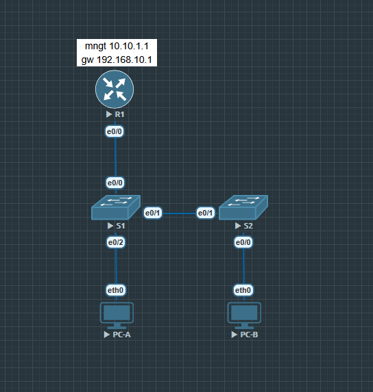

# Лабораторная работа - Настройка безопасности коммутатора

Комплексная лабораторная работа на повторение функций безопасности
уровня L2: VLAN, транки 802.1Q, порты доступа, Port Security,
DHCP Snooping, PortFast и BPDU Guard.

Выполнено в EVE-NG (образ Cisco IOL L2-ADVENTERPRISEK9-M, версия 15.2)
вместо Packet Tracer - платформа даёт более честную картину поведения
реального IOS, но использует нумерацию интерфейсов `EthernetX/Y`
вместо `FastEthernetX/Y` из методички.

---

## Топология



```
PC-A -- S1 (Et0/2) -- S1 (Et0/1, trunk) -- S2 (Et0/1) -- S2 (Et0/0) -- PC-B
S1 (Et0/0) -- R1 (G0/0/1)
```

---

## Таблица адресации

| Устройство | Интерфейс/VLAN | IP-адрес | Маска подсети |
|---|---|---|---|
| R1 | G0/0/1 | 192.168.10.1 | 255.255.255.0 |
| R1 | Loopback0 | 10.10.1.1 | 255.255.255.0 |
| S1 | VLAN 10 | 192.168.10.201 | 255.255.255.0 |
| S2 | VLAN 10 | 192.168.10.202 | 255.255.255.0 |
| PC-A | NIC | DHCP (192.168.10.11) | 255.255.255.0 |
| PC-B | NIC | DHCP (192.168.10.10) | 255.255.255.0 |

---

## Часть 1. Настройка основного сетевого устройства

### R1 - конфигурация подтверждена show running-config

```
R1# show running-config

hostname R1
no ip domain lookup
ip dhcp relay information trust-all
ip dhcp excluded-address 192.168.10.1 192.168.10.9
ip dhcp excluded-address 192.168.10.201 192.168.10.202
!
ip dhcp pool Students
 network 192.168.10.0 255.255.255.0
 default-router 192.168.10.1
 domain-name CCNA2.Lab-11.6.1
!
interface Loopback0
 ip address 10.10.1.1 255.255.255.0
!
interface Ethernet0/0
 description Link to S1
 ip address 192.168.10.1 255.255.255.0
!
line con 0
 exec-timeout 0 0
 logging synchronous
```

Интерфейс, обозначенный в методичке как `G0/0/1`, на используемой
платформе (Cisco IOL) отображается как `Ethernet0/0` - соответствие
прямое, номенклатура иная.

Команда `service password-encryption` на R1 намеренно не
используется - она отсутствует в исходном скрипте методички для
маршрутизатора, в отличие от S1/S2, где она применена.

### Базовая настройка S1 и S2

```
hostname S1 / S2
no ip domain-lookup
enable secret class
service password-encryption
banner motd ^CAuthorized Users Only!^C
!
line con 0
 password cisco
 login
line vty 0 4
 password cisco
 login
!
ip default-gateway 192.168.10.1
```

`ip default-gateway` настроен на обоих коммутаторах - это шлюз по
умолчанию для собственного управляющего трафика свитча (например,
при доступе к нему из другой подсети), отдельно от адресации SVI.

---

## Часть 2. Настройка сетей VLAN

### Создание VLAN на S1 и S2

```
vlan 10
 name Management
vlan 333
 name Native
vlan 999
 name ParkingLot
```

### SVI управления

```
S1(config)# interface vlan 10
S1(config-if)# ip address 192.168.10.201 255.255.255.0
S1(config-if)# no shutdown
```
Аналогично на S2 с адресом `192.168.10.202`.

**Важное наблюдение:** SVI VLAN 10 не поднимался в состояние `up/up`
до тех пор, пока VLAN 10 не был явно создан командой `vlan 10` в базе
данных VLAN на обоих коммутаторах - команды `interface vlan10` +
`ip address` недостаточно, если сам VLAN отсутствует в базе.

### Порты доступа

По методичке на S1 в VLAN 10 переводятся **оба** используемых порта -
и линк к R1, и линк к PC-A:

```
S1(config)# interface e0/0
S1(config-if)# switchport mode access
S1(config-if)# switchport access vlan 10
```
(порт к R1)

```
S1(config)# interface e0/2
S1(config-if)# switchport mode access
S1(config-if)# switchport access vlan 10
```
(порт к PC-A)

```
S2(config)# interface e0/0
S2(config-if)# switchport mode access
S2(config-if)# switchport access vlan 10
```
(порт к PC-B)

Итоговая проверка (`show interfaces status`) подтверждает оба порта
на S1 в VLAN 10:

```
S1# show interfaces status

Port    Name          Status      Vlan    Type
Et0/0   Link_to_R1    connected   10      unknown
Et0/1   Link_to_S2    connected   trunk   unknown
Et0/2   Link_to_PC-A  connected   10      unknown
```

### Неиспользуемые порты - Parking Lot

```
S1(config)# interface range e0/3, e1/0-3, e2/0-3, e3/0-3, e4/0-3, e5/0-3
S1(config-if-range)# switchport mode access
S1(config-if-range)# switchport access vlan 999
S1(config-if-range)# shutdown
```
Аналогично на S2 для всех неиспользуемых портов.

---

## Часть 3. Настройки безопасности коммутатора

### Магистральные соединения 802.1Q

```
S1(config)# interface e0/1
S1(config-if)# switchport mode trunk
S1(config-if)# switchport trunk native vlan 333
S1(config-if)# switchport nonegotiate
```
Аналогично на S2.

**Примечание по платформе:** команда `switchport trunk encapsulation
dot1q` отсутствует на данной платформе IOL - список `switchport ?`
не содержит такого параметра. Реальные коммутаторы Cisco 2960
поддерживают только dot1Q, поэтому явный выбор инкапсуляции не
требуется.

### Проверка транка

```
S1# show interfaces trunk

Port    Mode    Encapsulation  Status      Native vlan
Et0/1   on      802.1q         trunking    333

Port    Vlans allowed on trunk
Et0/1   1-4094

Port    Vlans allowed and active in management domain
Et0/1   1,10,333,999
```

```
S1# show interfaces e0/1 switchport | include Negotiation
Negotiation of Trunking: Off
```

**Обнаруженная и устранённая проблема:** в процессе настройки был
случайно переключён транковый порт S1/Et0/1 в режим access, что
вызвало срабатывание защитного механизма STP:

```
%SPANTREE-7-RECV_1Q_NON_TRUNK: Received 802.1Q BPDU on non trunk Ethernet0/1 VLAN10.
%SPANTREE-7-BLOCK_PORT_TYPE: Blocking Ethernet0/1 on VLAN0010. Inconsistent port type.
```

Порт был заблокирован STP из-за рассинхрона режимов на двух концах
одного линка (S2 продолжал слать тегированные BPDU, ожидая транк).
После возврата порта в режим trunk блокировка снялась автоматически,
подтверждено командой `show interfaces trunk`. Это демонстрирует
встроенную защиту STP от несогласованности типов портов на концах
одного кабеля.

Также была обнаружена похожая ситуация несовпадения native VLAN
между S1 и S2 в процессе настройки:

```
%CDP-4-NATIVE_VLAN_MISMATCH: Native VLAN mismatch discovered on Ethernet0/1 (333), with S1 Ethernet0/1 (1).
```

Разрешилась автоматически после того, как native vlan 333 был
настроен на обеих сторонах транка.

---

### Документирование и настройка Port Security

#### Настройки по умолчанию (S1, Et0/2, до включения)

```
S1# show port-security interface e0/2

Port Security              : Disabled
Port Status                : Secure-down
Violation Mode              : Shutdown
Aging Time                  : 0 mins
Aging Type                  : Absolute
SecureStatic Address Aging  : Disabled
Maximum MAC Addresses       : 1
Sticky MAC Addresses        : 0
```

#### Настройка Port Security на S1 (Et0/2, к PC-A)

```
S1(config)# interface e0/2
S1(config-if)# switchport port-security
S1(config-if)# switchport port-security maximum 3
S1(config-if)# switchport port-security violation restrict
S1(config-if)# switchport port-security aging time 60
S1(config-if)# switchport port-security aging type inactivity
```

#### Проверка (S1, после того как PC-A передал трафик)

```
S1# show port-security interface e0/2

Port Security              : Enabled
Port Status                : Secure-up
Violation Mode              : Restrict
Aging Time                  : 60 mins
Aging Type                  : Inactivity
Maximum MAC Addresses       : 3
Total MAC Addresses         : 1
Last Source Address:Vlan    : 0050.7966.6804:10
```

#### Настройка Port Security на S2 (Et0/0, к PC-B)

```
S2(config)# interface e0/0
S2(config-if)# switchport port-security
S2(config-if)# switchport port-security maximum 2
S2(config-if)# switchport port-security violation protect
S2(config-if)# switchport port-security aging time 60
S2(config-if)# switchport port-security mac-address sticky
```

#### Проверка (S2, после того как PC-B передал трафик)

```
S2# show port-security interface e0/0

Port Security              : Enabled
Port Status                : Secure-up
Violation Mode              : Protect
Aging Time                  : 60 mins
Aging Type                  : Absolute
Maximum MAC Addresses       : 2
Total MAC Addresses         : 1
Sticky MAC Addresses        : 1
Last Source Address:Vlan    : 0050.7966.6807:10
```

```
S2# show run interface e0/0
...
 switchport port-security mac-address sticky 0050.7966.6807
```

Sticky MAC-адрес автоматически выучился из трафика и был
зафиксирован в running-config без ручного ввода.

---

### DHCP Snooping (на S2)

```
S2(config)# ip dhcp snooping
S2(config)# ip dhcp snooping vlan 10
S2(config)# interface e0/1
S2(config-if)# ip dhcp snooping trust
S2(config)# interface e0/0
S2(config-if)# ip dhcp snooping limit rate 5
```

#### Проверка

```
S2# show ip dhcp snooping

Switch DHCP snooping is enabled
DHCP snooping is configured on following VLANs: 10
DHCP snooping is operational on following VLANs: 10

Interface       Trusted   Allow option   Rate limit (pps)
Ethernet0/0     no        no             5
Ethernet0/1     yes       yes            unlimited
```

#### Проверка привязки после обновления DHCP на PC-B

```
S2# show ip dhcp snooping binding

MacAddress          IpAddress        Lease(sec)  Type            VLAN  Interface
00:50:79:66:68:07    192.168.10.10    86379       dhcp-snooping   10    Ethernet0/0
Total number of bindings: 1
```

---

### PortFast и BPDU Guard

```
S1(config)# interface e0/2
S1(config-if)# spanning-tree portfast
S1(config-if)# spanning-tree bpduguard enable
```
Аналогично на S2 (interface e0/0).

#### Проверка (S1)

```
S1# show spanning-tree interface e0/2 detail

Port 3 (Ethernet0/2) of VLAN0010 is designated forwarding
   The port is in the portfast edge mode
   Bpdu guard is enabled
```

#### Проверка (S2)

```
S2# show spanning-tree interface e0/0 detail

Port 1 (Ethernet0/0) of VLAN0010 is designated forwarding
   The port is in the portfast edge mode
   Bpdu guard is enabled
```

---

### Проверка сквозного подключения

Пинги проверены со всех устройств друг к другу:

```
PC-A -> R1 (192.168.10.1):    5/5, 0% loss
PC-A -> S1 (192.168.10.201):  5/5, 0% loss
PC-A -> S2 (192.168.10.202):  5/5, 0% loss

PC-B -> R1 (192.168.10.1):    5/5, 0% loss
PC-B -> S1 (192.168.10.201):  5/5, 0% loss
PC-B -> S2 (192.168.10.202):  5/5, 0% loss
PC-B -> PC-A (192.168.10.11): 5/5, 0% loss (TTL=64, прямая L2-связь)
```

Полная сквозная связность подтверждена между всеми устройствами сети.

---

## Вопросы для повторения

**1. С точки зрения безопасности порта на S2, почему нет значения
таймера для оставшегося возраста в минутах, когда было
сконфигурировано динамическое обучение - sticky?**

Sticky MAC-адреса по умолчанию не подвержены старению (aging), даже
если на порту настроен `aging time`. Aging применяется только к
динамически (dynamic) выученным secure-адресам. Sticky-адрес
считается полупостоянным - он сохраняется в running-config и
переживает перезагрузку интерфейса, поэтому таймер "remaining age"
для него не отображается, пока явно не включена команда
`switchport port-security aging static`.

**2. Что касается безопасности порта на S2, если вы загружаете
скрипт текущей конфигурации на S2, почему порт 18 (порт к PC-B)
никогда не получит IP-адрес через DHCP?**

Sticky MAC-адрес PC-B уже сохранён в running-config
(`switchport port-security mac-address sticky 0050.7966.6807`). При
повторной загрузке этой же конфигурации порт будет ожидать именно
этот MAC как один из разрешённых. Если реальный MAC-адрес PC-B при
следующем запуске не совпадёт с сохранённым (например, при
пересоздании виртуальной машины) - режим `violation protect` тихо
отбросит его трафик без какого-либо уведомления (без log, без
shutdown порта), и DHCP-запрос физически не дойдёт до сети.

**3. Что касается безопасности порта, в чём разница между типом
абсолютного устаревания и типом устаревания по неактивности?**

- **Absolute** - таймер отсчитывается с момента добавления адреса в
  таблицу и не сбрасывается, даже если хост активно передаёт трафик.
  По истечении заданного времени адрес удаляется независимо от
  активности.
- **Inactivity** - таймер сбрасывается каждый раз, когда через порт
  проходит трафик от данного MAC-адреса. Адрес удаляется только если
  хост простаивал (не передавал трафик) дольше заданного времени.

В данной лабораторной работе на S1 (Et0/2) настроен тип `inactivity`,
а на S2 (Et0/0) остался тип по умолчанию - `absolute`.